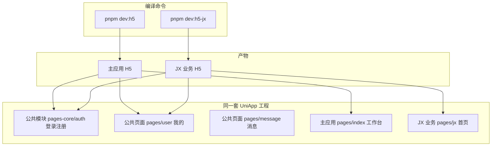

# uniapp基于条件编译实现一套代码多应用开发实践
### 在开发实践中通常应用基座经常实践和时间的累计通代码质量比较稳定，新项目启动通常会基于基座进行开发，但是有时候基座的维护在多应用时会不同步那么一个处理方案就是一套基座代码多个业务应用公用，本文章就是介绍uniapp的实际解决方案。
在企业内部，多个业务线往往各自独立部署 H5，但登录、个人中心、消息等能力又希望只维护一份。传统做法是为每个业务建一个仓库，或复制粘贴改配置——维护成本高、Bug 容易分叉。

本文基于 **芋道 `unibest 模板`** 的实际改造，说明如何用 uni-app **自定义编译平台 + `#ifdef` 条件编译**，实现「一套代码、多个 H5 应用分开发布」。示例包含默认主应用与 **H5_JX** 业务包。

# 1. 整体架构



**设计原则：**

| 层级 | 策略 |
|------|------|
| 公共能力 | 登录（`pages-core/auth`）、我的（`pages/user`）等不分支，所有包复用 |
| 业务差异 | 首页、TabBar 业务 Tab、业务组件用 `#ifdef H5_JX` 区分 |
| 编译入口 | `package.json` 自定义平台 + 独立 `dev/build` 脚本 |

推荐目录结构：

```
src/pages/
├── index/          # 主应用首页
├── jx/             # JX 业务首页
├── user/           # 公共：我的
├── message/        # 公共：消息
pages-core/
└── auth/           # 公共：登录注册
```

# 2. 声明自定义平台

在 `package.json` 的 `uni-app.scripts` 中注册自定义平台。**平台名与 `define` 宏名保持一致**（如 `H5_JX`）：

```json
"uni-app": {
  "scripts": {
    "H5_JX": {
      "title": "H5_JX",
      "browser": "edge",
      "env": {
        "UNI_PLATFORM": "h5"
      },
      "define": {
        "H5_JX": true
      }
    }
  }
}
```

说明：

- `env.UNI_PLATFORM: "h5"`：底层仍是 H5 编译，可复用 H5 能力
- `define.H5_JX: true`：注入条件编译宏，源码中可用 `#ifdef H5_JX`

配套 npm scripts：

```json
"dev:h5-jx": "uni -p H5_JX",
"dev:h5-jx:test": "uni -p H5_JX --mode test",
"dev:h5-jx:prod": "uni -p H5_JX --mode production",
"build:h5-jx": "uni build -p H5_JX",
"build:h5-jx:prod": "uni build -p H5_JX --mode production",
"dev:h5": "uni",
"build:h5": "uni build"
```

> **注意**：命令必须是 `uni -p H5_JX`，`-p` 后的名称与 `uni-app.scripts` 的 key 一致。写成 `uni H5_JX`（缺少 `-p`）会导致自定义平台不生效。

# 3. 差异化首页

每个业务模块有独立首页目录，例如 `src/pages/jx/index.vue`。

**主应用首页**（`pages/index/index.vue`）—— 非 JX 包才作为 home：

```vue
<script lang="ts" setup>
defineOptions({ name: 'Home' })

// #ifdef !H5_JX
definePage({
  type: 'home',
  style: { navigationStyle: 'custom' },
})
// #endif
</script>
```

**JX 业务首页**（`pages/jx/index.vue`）—— 仅 JX 包作为 home：

```vue
<script lang="ts" setup>
defineOptions({ name: 'JxHome' })

// #ifdef H5_JX
definePage({
  type: 'home',
  style: { navigationStyle: 'custom' },
})
// #endif
</script>
```

编译后，`pages.json` 中只有一个 `type: "home"` 的页面。登录成功后的跳转由框架自动解析（unibest 模板中 `HOME_PAGE` 读取 `pages.json` 里 `type === 'home'` 的页面）：

```typescript
export const HOME_PAGE = `/${pages.find(page => page.type === 'home')?.path || pages[0].path}`
```

JX 包登录后会进入 `/pages/jx/index`，主应用进入 `/pages/index/index`，**无需改登录逻辑**。

# 4. 差异化 TabBar

在 `src/tabbar/config.ts` 中，用条件编译区分业务 Tab，公共 Tab 保持不变：

```typescript
export const customTabbarList: CustomTabBarItem[] = [
  // #ifdef !H5_JX
  {
    text: '工作台',
    pagePath: 'pages/index/index',
    iconType: 'unocss',
    icon: 'i-carbon-home',
  },
  {
    text: '审批',
    pagePath: 'pages/bpm/index',
    iconType: 'unocss',
    icon: 'i-carbon-document',
  },
  {
    text: '通讯录',
    pagePath: 'pages/contact/index',
    iconType: 'unocss',
    icon: 'i-carbon-user-avatar',
  },
  // #endif

  // #ifdef H5_JX
  {
    text: '首页',
    pagePath: 'pages/jx/index',
    iconType: 'unocss',
    icon: 'i-carbon-home',
  },
  // #endif

  // 公共 Tab：所有包复用
  {
    text: '消息',
    pagePath: 'pages/message/index',
    iconType: 'unocss',
    icon: 'i-carbon-chat',
  },
  {
    text: '我的',
    pagePath: 'pages/user/index',
    iconType: 'unocss',
    icon: 'i-carbon-user',
  },
]
```

编译结果对比：

| 平台 | TabBar |
|------|--------|
| 默认 H5 | 工作台 / 审批 / 通讯录 / 消息 / 我的 |
| H5_JX | 首页 / 消息 / 我的 |

修改 `tabbar/config.ts` 后需**重新运行** dev 命令，否则 `pages.json` 不会更新。

# 5. 业务逻辑中的条件编译

除页面和 TabBar 外，任意 `.vue` / `.ts` 都可用 `#ifdef`：

```vue
<template>
  <view>
    <!-- #ifdef H5_JX -->
    <JxBanner />
    <!-- #endif -->

    <!-- #ifndef H5_JX -->
    <HomeBanner />
    <!-- #endif -->
  </view>
</template>
```

```typescript
// #ifdef H5_JX
export const API_MODULE = 'jx'
// #endif

// #ifndef H5_JX
export const API_MODULE = 'default'
// #endif
```

常用指令：

| 指令 | 含义 |
|------|------|
| `#ifdef H5_JX` | 仅 JX 包编译 |
| `#ifndef H5_JX` | 非 JX 包编译 |
| `#ifdef H5` | 所有 H5 包（含自定义 H5 平台） |
| `#endif` | 结束条件块 |

# 6. 关键踩坑：配置文件的「两套编译环境」

这是实践中最重要的经验。

## 6.1 两类文件，两种处理方式

| 文件类型 | 示例 | `#ifdef` 是否自动生效 |
|----------|------|----------------------|
| 业务源码 | `.vue`、业务 `.ts` | ✅ uni 编译链自动预处理 |
| Node 侧配置 | `pages.config.ts` 直接 import 的 `tabbar/config.ts` | ❌ 默认不预处理 |

`pages.config.ts` 在 Vite 启动时由 Node（jiti）直接加载。此时 `#ifdef` 只是普通注释，**两个分支的代码都会保留**，导致 TabBar 项被合并、或出现重复声明错误。

## 6.2 正确做法：对配置走 uni 预处理器

在 `pages.config.ts` 加载 tabbar 前，用 uni 官方预处理器 + `UNI_CUSTOM_CONTEXT` 处理：

```typescript
import fs from 'node:fs'
import path from 'node:path'
import { fileURLToPath } from 'node:url'
import { createJiti } from 'jiti'
import { defineUniPages } from '@uni-helper/vite-plugin-uni-pages'

const __dirname = path.dirname(fileURLToPath(import.meta.url))

/** 读取 uni 自定义平台条件编译上下文（与 #ifdef H5_JX 同源） */
function getUniPreContext(): Record<string, boolean> {
  const context: Record<string, boolean> = {
    H5: process.env.UNI_PLATFORM === 'h5',
    WEB: process.env.UNI_PLATFORM === 'h5',
  }
  // uni -p H5_JX 时，CLI 注入 UNI_CUSTOM_CONTEXT = {"H5_JX":true}
  if (process.env.UNI_CUSTOM_CONTEXT) {
    try {
      const parsed = JSON.parse(process.env.UNI_CUSTOM_CONTEXT) as Record<string, boolean>
      for (const [key, value] of Object.entries(parsed)) {
        context[key] = !!value
      }
    } catch {
      // ignore
    }
  }
  return context
}

/** tabbar/config.ts 需先预处理，#ifdef 才能生效 */
function loadTabbarConfig() {
  const { preprocess } = require('@dcloudio/uni-cli-shared/lib/preprocess')
  const configPath = path.resolve(__dirname, 'src/tabbar/config.ts')
  const source = fs.readFileSync(configPath, 'utf-8')
  const processed = preprocess(source, getUniPreContext(), { type: 'js' })
  const runtimePath = path.resolve(__dirname, 'src/tabbar/.config.runtime.ts')
  fs.writeFileSync(runtimePath, processed, 'utf-8')
  const jiti = createJiti(__dirname, { interopDefault: true })
  return jiti(runtimePath)
}

const { tabBar } = loadTabbarConfig()

export default defineUniPages({
  // ...globalStyle、easycom 等
  tabBar: tabBar as any,
})
```

`.gitignore` 中建议忽略运行时产物：

```
src/tabbar/.config.runtime.ts
```

> **说明**：`UNI_CUSTOM_CONTEXT` 来自 `package.json → uni-app.scripts → define`，由 uni CLI 在 `uni -p H5_JX` 时注入，与源码中的 `#ifdef H5_JX` 同源。不要用 `process.argv` 自行判断平台。

## 6.3 首页的补充保障

`definePage({ type: 'home' })` 的扫描时机可能早于条件编译。可在 `vite.config.ts` 中配合 `homePage`：

```typescript
/** 与 #ifdef H5_JX 同源：读取 uni 注入的 UNI_CUSTOM_CONTEXT */
function resolveHomePage() {
  try {
    const ctx = JSON.parse(process.env.UNI_CUSTOM_CONTEXT || '{}') as Record<string, boolean>
    if (ctx.H5_JX) {
      return 'pages/jx/index'
    }
  } catch {
    // ignore
  }
  return 'pages/index/index'
}

UniPages({
  homePage: resolveHomePage(),
  // ...
})
```

# 7. 开发与发布命令

```bash
# 主应用（默认 H5）
pnpm dev:h5
pnpm build:h5:prod

# JX 业务包
pnpm dev:h5-jx
pnpm build:h5-jx:prod
```

**务必用对应命令启动**，混用会导致 `pages.json` 缓存了错误平台的 TabBar / 首页配置。

验证方式：启动后检查 `src/pages.json` 中 TabBar 的 `list` 与首页 `type: "home"` 是否符合预期。

# 8. 扩展新业务模块（如 H5_XXX）

按以下清单新增即可：

1. **`package.json`**：增加 `uni-app.scripts.H5_XXX` 及 `dev/build:h5-xxx` 脚本
2. **首页**：新建 `pages/xxx/index.vue`，`#ifdef H5_XXX` 声明 `type: 'home'`
3. **原首页**：增加 `#ifndef H5_XXX` 包裹原有 `type: 'home'`
4. **TabBar**：在 `customTabbarList` 增加 `#ifdef H5_XXX` 业务 Tab
5. **业务代码**：按需使用 `#ifdef H5_XXX` 分支
6. **验证**：分别执行 `pnpm dev:h5-xxx` 与 `pnpm dev:h5`，检查 `pages.json`

# 9. 方案对比与适用场景

| 方案 | 优点 | 缺点 |
|------|------|------|
| 多仓库 | 隔离彻底 | 公共代码难同步 |
| 环境变量分支 | 实现简单 | 运行时分支，包体积不优 |
| **条件编译（本文）** | 编译期裁剪、零运行时开销、公共代码统一 | 需理解配置文件的预处理机制 |
| Monorepo 子包 | 模块边界清晰 | 工程复杂度更高 |

**适用场景：**

- 多个 H5 业务包，差异集中在首页 / TabBar / 部分页面
- 登录、个人中心等强复用
- 希望 CI 一条流水线、不同命令出不同包

# 10. 总结

UniApp 多应用发布的核心思路：

1. **自定义平台**（`uni-app.scripts`）注入编译宏（如 `H5_JX`）
2. **`#ifdef` 条件编译**区分首页、TabBar、业务逻辑
3. **公共模块不分支**，登录 / 我的等全包复用
4. **配置文件特殊处理**：`pages.config.ts` 引用的 tabbar 配置需走 uni 预处理器
5. **独立 dev/build 命令**，避免平台配置互相污染

按此模式，可以在一个仓库内持续扩展 JX、OA、CRM 等多个 H5 应用，而登录跳转、Token 管理、个人中心等基础设施始终只维护一份。

